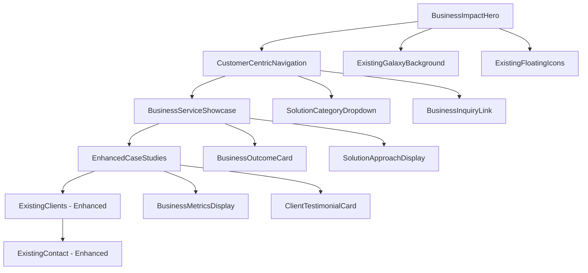

# Xala Website Enhancement - Brownfield Enhancement Architecture

## Introduction

This document outlines the architectural approach for enhancing Xala Technologies website with business-impact driven transformation inspired by Proventus positioning. Its primary goal is to serve as the guiding architectural blueprint for AI-driven development of new features while ensuring seamless integration with the existing system.

**Relationship to Existing Architecture:**
This document supplements existing project architecture by defining how new business-focused components will integrate with current systems. Where conflicts arise between new and existing patterns, this document provides guidance on maintaining consistency while implementing enhancements.

### Existing Project Analysis

**Current Project State:**
- **Primary Purpose:** Sophisticated technology consulting company website showcasing capabilities to Norwegian and international markets
- **Current Tech Stack:** React 18, TypeScript, Tailwind CSS, Vite, Supabase, OpenAI integration
- **Architecture Style:** Component-based SPA with modern React patterns, server-side rendering capabilities, and microservices backend
- **Deployment Method:** Modern web deployment with Vite build system, Vercel/Netlify compatible

**Available Documentation:**
- Complete React component structure with organized folders
- TypeScript configurations and type definitions  
- Tailwind CSS design system implementation
- Supabase integration documentation
- i18n configuration for Norwegian/English support
- SEO optimization with structured data

**Identified Constraints:**
- Must maintain existing Supabase database schema
- Cannot break current AI chat functionality
- Must preserve admin portal access and functionality
- Norwegian/English i18n must continue working
- Current performance characteristics must be maintained

## Enhancement Scope and Integration Strategy

### Enhancement Overview
**Enhancement Type:** Major UI/UX transformation with business messaging overhaul
**Scope:** Transform technology-focused positioning to business-impact driven platform
**Integration Impact:** Significant content and component modifications with preserved core functionality

### Integration Approach
**Code Integration Strategy:** Extend existing React components with business-focused variants while preserving technical depth layers
**Database Integration:** Utilize existing Supabase structure with enhanced content models for case studies and client success stories
**API Integration:** Maintain all current APIs while adding enhanced content management capabilities
**UI Integration:** Evolve existing design system with business-focused component variants inspired by Proventus approach

### Compatibility Requirements
- **Existing API Compatibility:** All Supabase endpoints, AI chat, and admin APIs remain fully functional
- **Database Schema Compatibility:** No breaking changes to existing tables, only additive enhancements
- **UI/UX Consistency:** New components integrate seamlessly with existing design tokens and patterns
- **Performance Impact:** No degradation to current page load speeds or animation performance

## Tech Stack Alignment

### Existing Technology Stack

| Category | Current Technology | Version | Usage in Enhancement | Notes |
|----------|-------------------|---------|---------------------|-------|
| Frontend Framework | React | 18.x | Core framework for new components | Maintain current version |
| Language | TypeScript | Latest | All new code in TypeScript | Existing type safety patterns |
| Styling | Tailwind CSS | 3.x | Business-focused component styling | Extend existing utility classes |
| Build Tool | Vite | 5.x | Development and production builds | Current configuration preserved |
| Backend | Supabase | Latest | Database and API services | Existing integrations maintained |
| State Management | React Hooks/Context | Built-in | Component state management | Follow existing patterns |
| Internationalization | react-i18next | Current | Enhanced business messaging | Extend existing translation keys |
| UI Components | shadcn/ui + Custom | Current | Business-focused component variants | Build upon existing library |

### New Technology Additions
No new technologies required - enhancement builds entirely on existing stack.

## Data Models and Schema Changes

### New Data Models

#### **BusinessImpactStory**
**Purpose:** Store quantifiable client success stories and business impact metrics
**Integration:** Extends existing client/project data without modifying current structures

**Key Attributes:**
- id: string - Unique identifier
- client_name: string - References existing client data
- project_title: string - Business-focused project name
- business_challenge: text - Problem solved description
- solution_approach: text - How Xala addressed the challenge
- quantifiable_results: json - Metrics and business impact data
- project_duration: string - Timeline information
- technology_stack: array - Technical implementation details
- testimonial_quote: text - Client testimonial
- display_priority: number - Showcase ordering
- created_at: timestamp - Record creation
- updated_at: timestamp - Last modification

**Relationships:**
- **With Existing:** Links to current client logos and basic information
- **With New:** Connects to enhanced service categories and case study presentations

#### **BusinessServiceCategory**
**Purpose:** Business-focused service presentation inspired by Proventus approach
**Integration:** Maps to existing technical services while adding business positioning

**Key Attributes:**
- id: string - Unique identifier
- service_name: string - Business-focused service name
- customer_challenge: text - Problem this service solves
- business_outcome: text - Expected business results
- technical_solution: text - Technical implementation approach
- success_metrics: json - How success is measured
- typical_timeline: string - Project duration expectations
- investment_range: string - Budget guidance
- related_case_studies: array - References to BusinessImpactStory
- display_order: number - Navigation ordering

### Schema Integration Strategy
**Database Changes Required:**
- **New Tables:** business_impact_stories, business_service_categories, enhanced_client_testimonials
- **Modified Tables:** None - all changes are additive
- **New Indexes:** Performance indexes for story/service lookups and display ordering
- **Migration Strategy:** Additive migrations only, no breaking changes to existing data

**Backward Compatibility:**
- All existing database queries continue working unchanged
- Current admin portal functionality preserved
- Existing API endpoints maintain same response structures

## Component Architecture

### New Components

#### **BusinessImpactHero**
**Responsibility:** Transform hero section from technology-focus to business-impact messaging while preserving visual excellence
**Integration Points:** Replaces existing Hero component content while maintaining animation and visual framework

**Key Interfaces:**
- IBusinessHeroContent - Enhanced content structure for business messaging
- IProventusInspiredLayout - Design patterns inspired by competitive analysis

**Dependencies:**
- **Existing Components:** GalaxyBackground, FloatingIcons, ActionButtons (preserved)
- **New Components:** BusinessValueProposition, CustomerCentricCTA

**Technology Stack:** React, TypeScript, Tailwind CSS, react-i18next for bilingual business messaging

#### **BusinessServiceShowcase**
**Responsibility:** Present services as business solutions rather than technical categories
**Integration Points:** Enhances existing Services component with customer-centric presentation

**Key Interfaces:**
- IBusinessService - Service data with business focus
- ICustomerChallenge - Problem-solution framework

**Dependencies:**
- **Existing Components:** ServiceCard, ServiceGrid (enhanced variants)
- **New Components:** BusinessOutcomeCard, SolutionApproachDisplay

#### **EnhancedCaseStudies**
**Responsibility:** Activate commented case studies with business impact focus
**Integration Points:** Implements previously commented CaseStudies component with enhanced data model

**Key Interfaces:**
- IBusinessImpactStory - Comprehensive case study data structure
- IQuantifiableResults - Metrics and business outcomes

**Dependencies:**
- **Existing Components:** Existing card layouts and grid systems
- **New Components:** BusinessMetricsDisplay, ClientTestimonialCard

#### **CustomerCentricNavigation**
**Responsibility:** Transform navigation from traditional tech structure to customer journey focus
**Integration Points:** Enhances existing NavigationMenu with problem-solution framework

**Key Interfaces:**
- ICustomerJourneyNav - Navigation structure based on customer needs
- IBusinessSolutionMenu - Service organization by business outcome

**Dependencies:**
- **Existing Components:** NavigationMenu base functionality
- **New Components:** SolutionCategoryDropdown, BusinessInquiryLink

### Component Interaction Diagram



## Source Tree Integration

### Existing Project Structure
```
xala-web-cloner/
├── src/
│   ├── components/
│   │   ├── Hero.tsx
│   │   ├── Services.tsx
│   │   ├── CaseStudies.tsx (commented)
│   │   ├── Clients.tsx
│   │   └── navbar/
│   ├── hooks/
│   ├── i18n/
│   └── types/
├── public/
└── docs/
```

### New File Organization
```
xala-web-cloner/
├── src/
│   ├── components/
│   │   ├── business/                    # New business-focused components
│   │   │   ├── BusinessImpactHero.tsx
│   │   │   ├── BusinessServiceShowcase.tsx
│   │   │   ├── EnhancedCaseStudies.tsx
│   │   │   └── CustomerCentricNav.tsx
│   │   ├── enhanced/                    # Enhanced existing components
│   │   │   ├── EnhancedClients.tsx
│   │   │   └── EnhancedContact.tsx
│   │   ├── Hero.tsx                     # Existing (may be replaced)
│   │   └── Services.tsx                 # Existing (enhanced)
│   ├── types/
│   │   └── business.ts                  # New business-focused type definitions
│   └── hooks/
│       └── use-business-content.ts      # Business content management
├── docs/
│   ├── PRD-Xala-Website-Enhancement.md # Completed
│   └── Technical-Architecture-Xala-Enhancement.md # This document
```

### Integration Guidelines
- **File Naming:** Follow existing kebab-case for components, camelCase for utilities
- **Folder Organization:** Group business-focused components separately while maintaining existing structure
- **Import/Export Patterns:** Use existing barrel exports and absolute imports with @ alias

## Infrastructure and Deployment Integration

### Existing Infrastructure
**Current Deployment:** Vite-based build system with modern web deployment pipeline
**Infrastructure Tools:** Node.js, pnpm, Supabase cloud services
**Environments:** Development, staging/preview, production

### Enhancement Deployment Strategy
**Deployment Approach:** Incremental deployment using existing pipeline with feature flags for gradual rollout
**Infrastructure Changes:** None required - enhancement works within current infrastructure
**Pipeline Integration:** Utilize existing build and deployment processes without modification

### Rollback Strategy
**Rollback Method:** Component-level rollback using Git-based deployment with preserved original components
**Risk Mitigation:** Feature flags enable quick disable of new business components if issues arise
**Monitoring:** Existing analytics and performance monitoring continue tracking enhanced components

## Coding Standards and Conventions

### Existing Standards Compliance
**Code Style:** TypeScript strict mode, ESLint configuration, Prettier formatting
**Linting Rules:** Current ESLint + React hooks rules maintained
**Testing Patterns:** Vitest testing framework with component testing patterns
**Documentation Style:** JSDoc comments for complex business logic and component interfaces

### Critical Integration Rules
- **Existing API Compatibility:** All Supabase queries and mutations remain unchanged
- **Database Integration:** New data access follows existing Supabase client patterns
- **Error Handling:** Maintain existing error boundary and user feedback patterns
- **Logging Consistency:** Use existing console and analytics logging approaches

## Testing Strategy

### Integration with Existing Tests
**Existing Test Framework:** Vitest with React Testing Library
**Test Organization:** Component tests in __tests__ directories, hooks tests in hooks/
**Coverage Requirements:** Maintain current coverage levels while adding business component tests

### New Testing Requirements

#### Unit Tests for New Components
- **Framework:** Vitest (existing)
- **Location:** src/components/business/__tests__/
- **Coverage Target:** 80%+ for new business components
- **Integration with Existing:** Follow current testing patterns and utilities

#### Integration Tests
- **Scope:** Business component integration with existing data sources and navigation
- **Existing System Verification:** Ensure new components don't break existing functionality
- **New Feature Testing:** Validate business messaging and case study presentation

#### Regression Testing
- **Existing Feature Verification:** Automated tests ensuring original functionality preserved
- **Automated Regression Suite:** Extend existing test suite with business component scenarios
- **Manual Testing Requirements:** Visual regression testing for business-focused design changes

## Security Integration

### Existing Security Measures
**Authentication:** Supabase Auth with existing user management
**Authorization:** Current role-based access control for admin features
**Data Protection:** Existing GDPR compliance and data handling procedures
**Security Tools:** Current security headers and content security policies

### Enhancement Security Requirements
**New Security Measures:** Validate business content input in enhanced case studies
**Integration Points:** Ensure business data follows existing security validation patterns
**Compliance Requirements:** Maintain GDPR compliance for enhanced client success stories

### Security Testing
**Existing Security Tests:** Current authentication and authorization tests maintained
**New Security Test Requirements:** Input validation for business content management
**Penetration Testing:** Include new business components in existing security review processes

## Next Steps

### Story Manager Handoff
The architecture is ready for story creation with clear integration requirements:
- Reference this architecture document for technical constraints
- Key integration requirement: maintain existing Supabase functionality
- Existing system constraints: preserve admin portal, AI chat, and i18n capabilities  
- First story: Implement BusinessImpactHero with existing Hero component integration
- Emphasis: Each story must include verification that existing functionality remains intact

### Developer Handoff
Implementation is ready to begin with clear technical guidance:
- Reference this architecture and existing React/TypeScript patterns
- Integration requirement: all new components must extend existing design system
- Key technical decisions: build upon current component library, no framework changes
- Existing system compatibility: verify admin portal and AI chat continue working after each implementation
- Clear sequencing: implement business components incrementally, test existing functionality continuously

---

**Change Log**

| Change | Date | Version | Description | Author |
|--------|------|---------|-------------|--------|
| Initial Architecture | 2025-01-30 | 1.0 | Comprehensive brownfield enhancement architecture based on PRD and codebase analysis | Amin (Architect Agent) |
