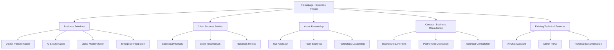
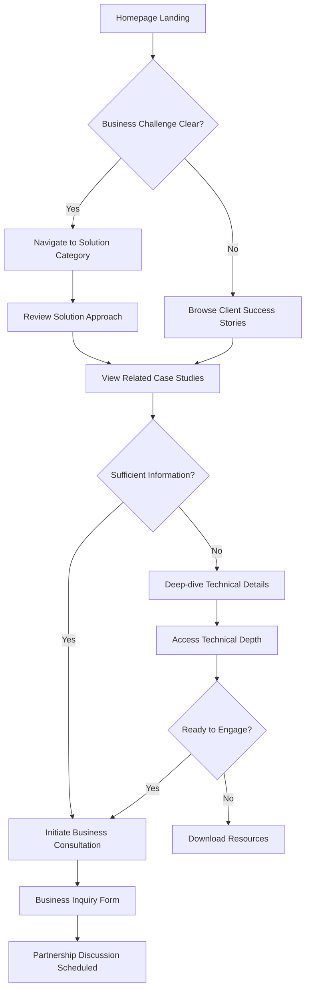
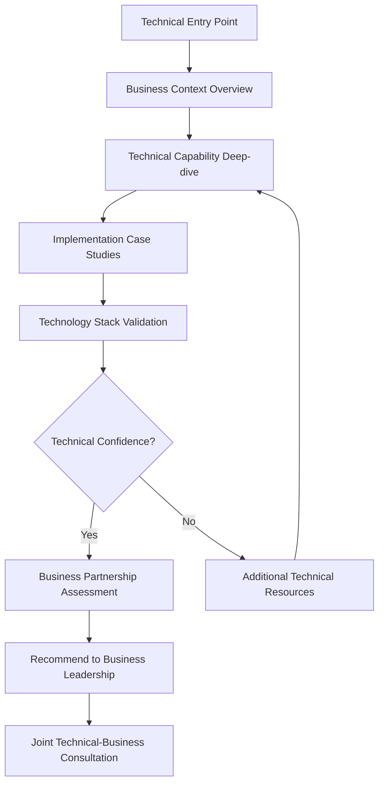

# Xala Website Enhancement - UI/UX Specification

## Introduction

This document defines the user experience goals, information architecture, user flows, and visual design specifications for Xala's website transformation into a business-impact driven platform. It serves as the foundation for visual design and frontend development, ensuring a cohesive and user-centered experience that positions Xala as a digital transformation partner.

### Overall UX Goals & Principles

#### Target User Personas

**Primary: Business Decision-Maker (Norwegian Market)**
- **Profile**: C-level executives, IT directors, and department heads in Norwegian companies
- **Goals**: Find technology partners who understand business transformation, not just technical implementation
- **Pain Points**: Too much technical jargon, unclear business value, difficulty assessing transformation capability
- **Success Metrics**: Can quickly understand business value and initiate consultation within 2-3 minutes

**Secondary: International Business Leader**
- **Profile**: Scale-up companies and enterprises seeking digital transformation partners
- **Goals**: Evaluate technical capabilities within business partnership context
- **Pain Points**: Need both technical excellence and business understanding
- **Success Metrics**: Can assess capability for their specific business transformation needs

**Tertiary: Technical Evaluator**
- **Profile**: CTOs, technical directors who evaluate implementation capabilities
- **Goals**: Assess technical depth while understanding business impact approach
- **Pain Points**: Want technical detail but within business context
- **Success Metrics**: Can access technical depth without losing business transformation narrative

#### Usability Goals

1. **Business Value Clarity**: Visitors understand Xala's business transformation value within 30 seconds of landing
2. **Navigation Efficiency**: Business leaders can find relevant services through problem-solution navigation in under 1 minute
3. **Case Study Access**: Success stories and quantifiable results are immediately accessible and compelling
4. **Consultation Initiation**: Business inquiry process is streamlined with clear value proposition at each step
5. **Technical Depth on Demand**: Technical capabilities accessible without overwhelming business-focused presentation

#### Design Principles

1. **Business Impact First**: Lead with business outcomes, support with technical excellence
2. **Norwegian Excellence**: Emphasize local market leadership while maintaining international appeal
3. **Proventus-Inspired Clarity**: Adopt successful customer-centric patterns from competitive analysis
4. **Visual Sophistication**: Maintain existing premium visual design while enhancing business messaging
5. **Seamless Integration**: Preserve all existing functionality while transforming positioning

## Information Architecture (IA)

### Site Map / Screen Inventory

### Navigation Structure

**Primary Navigation:** Problem-solution framework inspired by Proventus
- Business Solutions (replaces "Services")
- Client Success (replaces "Case Studies" - now active)
- Partnership Approach (enhanced "About") 
- Contact & Consultation (enhanced contact)

**Secondary Navigation:** Solution-specific navigation within Business Solutions
- By Business Challenge (What problem are you solving?)
- By Industry Focus (Norwegian public sector, international scale-ups)
- By Technology Approach (AI-driven, cloud-native, integration-focused)

**Breadcrumb Strategy:** Business context preservation
- Home > Business Solutions > [Specific Solution] > [Technical Details]
- Allows users to dive deep into technical implementation while maintaining business context

## User Flows

### Flow 1: Business Leader Discovery Journey

**User Goal:** Assess Xala as potential digital transformation partner

**Entry Points:** Homepage hero, business solutions navigation, case study highlights

**Success Criteria:** User initiates business consultation or downloads capability overview

#### Flow Diagram

#### Edge Cases & Error Handling
- User seeks technical detail first: Provide technical access without losing business context
- Norwegian content preference: Automatic language detection with manual override
- Mobile business review: Optimized case study presentation for mobile decision-makers
- Multiple business challenges: Solution comparison and combination guidance

**Notes:** Flow emphasizes business value first but provides clear paths to technical validation

### Flow 2: Technical Evaluator Validation Journey

**User Goal:** Validate technical capabilities within business partnership context

**Entry Points:** Technical team referral, deep-dive from business flow, direct technical search

**Success Criteria:** Technical validation completed with business partnership confidence

#### Flow Diagram

#### Edge Cases & Error Handling
- Technical depth insufficient: Progressive disclosure to full technical documentation
- Integration complexity concerns: Specific case studies for complex integrations
- Technology stack misalignment: Alternative approach presentations

**Notes:** Maintains business transformation context throughout technical evaluation

## Wireframes & Mockups

### Design Files
**Primary Design Files:** Integration with existing Xala design system - build upon current sophisticated visual framework

### Key Screen Layouts

#### Homepage - Business Impact Hero

**Purpose:** Transform technology-focused messaging to business-impact positioning while preserving visual excellence

**Key Elements:**
- Business transformation headline: "Vi bruger teknologi for å skape positiv endring"
- Customer-centric value proposition with Proventus-inspired messaging
- Business outcome highlights with quantifiable metrics
- Client success story carousel with business impact focus
- Clear call-to-action for business consultation

**Interaction Notes:** Maintain existing galaxy background and animations while enhancing content for business impact

**Design File Reference:** Enhance existing Hero component with business-focused content variants

#### Business Solutions Overview

**Purpose:** Present services as business solutions rather than technical categories

**Key Elements:**
- Problem-solution navigation inspired by Proventus structure
- Business challenge identification section
- Solution approach with business outcomes
- Technical implementation details available on-demand
- Related case studies and success metrics

**Interaction Notes:** Progressive disclosure from business challenge to technical implementation details

**Design File Reference:** Transform existing Services component with customer-centric presentation

#### Enhanced Case Studies

**Purpose:** Activate case studies with business impact presentation and quantifiable results

**Key Elements:**
- Business challenge and transformation narrative
- Quantifiable business results and ROI metrics
- Technical solution approach and innovation highlights
- Client testimonials with business impact focus
- Timeline and investment guidance

**Interaction Notes:** Modal or expanded view for detailed case study exploration with business and technical tabs

**Design File Reference:** Implement previously commented CaseStudies component with enhanced data presentation

## Component Library / Design System

### Design System Approach
**Extend existing Xala design system** with business-focused component variants while preserving premium visual sophistication and technical excellence positioning.

### Core Components

#### BusinessImpactCard
**Purpose:** Present business outcomes and transformation results with visual impact
**Variants:** Metric highlight, case study summary, client testimonial, solution outcome
**States:** Default, hover, expanded detail, loading
**Usage Guidelines:** Always lead with business value, support with technical approach details

#### CustomerChallengeSelector
**Purpose:** Help visitors identify their business challenges and find relevant solutions
**Variants:** Industry-specific, challenge-category, interactive assessment
**States:** Selection, validation, solution matching, results presentation
**Usage Guidelines:** Progressive disclosure from challenge identification to solution presentation

#### SolutionJourneyFlow
**Purpose:** Guide users through solution understanding from business challenge to technical implementation
**Variants:** Linear flow, branching paths, technical deep-dive, business summary
**States:** Overview, detailed exploration, technical validation, consultation readiness
**Usage Guidelines:** Maintain business context throughout technical exploration

#### EnhancedTestimonial
**Purpose:** Present client success stories with business impact emphasis
**Variants:** Quote highlight, detailed case study, metric showcase, video testimonial
**States:** Summary view, expanded detail, technical implementation view
**Usage Guidelines:** Always include quantifiable business results and transformation outcomes

## Branding & Style Guide

### Visual Identity
**Brand Guidelines:** Maintain existing Xala premium brand identity while enhancing business-focused messaging and Proventus-inspired customer-centric approach

### Color Palette
| Color Type | Hex Code | Usage |
|------------|----------|-------|
| Primary | #9b87f5 | Business transformation highlights, CTAs |
| Secondary | #D946EF | Innovation and AI capabilities emphasis |
| Accent | #0EA5E9 | Technical excellence and reliability |
| Success | #10B981 | Business results, positive outcomes |
| Warning | #F59E0B | Important business considerations |
| Error | #EF4444 | Critical information, urgent actions |
| Neutral | #64748B, #E2E8F0 | Text, borders, business-professional backgrounds |

### Typography

#### Font Families
- **Primary:** Inter (existing) - Professional business communication
- **Secondary:** JetBrains Mono (existing) - Technical documentation and code
- **Display:** Inter Display - Large headings and business impact statements

#### Type Scale
| Element | Size | Weight | Line Height |
|---------|------|--------|-------------|
| H1 | 3.5rem | 700 | 1.1 |
| H2 | 2.5rem | 600 | 1.2 |
| H3 | 1.875rem | 600 | 1.3 |
| Body | 1rem | 400 | 1.6 |
| Small | 0.875rem | 400 | 1.5 |

### Iconography
**Icon Library:** Heroicons (existing) with business-focused additions
**Usage Guidelines:** Emphasize business outcomes and transformation icons alongside existing technical icons

### Spacing & Layout
**Grid System:** 12-column responsive grid (existing)
**Spacing Scale:** 0.25rem base unit with 8px increments (existing Tailwind scale)

## Accessibility Requirements

### Compliance Target
**Standard:** WCAG 2.1 AA compliance maintained from existing implementation

### Key Requirements

**Visual:**
- Color contrast ratios: 4.5:1 for normal text, 3:1 for large text
- Focus indicators: Visible focus rings with 2px minimum width
- Text sizing: Minimum 16px for body text, scalable to 200% without horizontal scroll

**Interaction:**
- Keyboard navigation: Full keyboard accessibility for all business consultation flows
- Screen reader support: Semantic HTML and ARIA labels for business content
- Touch targets: Minimum 44px for mobile business decision-maker accessibility

**Content:**
- Alternative text: Business-focused descriptions for case study images and infographics
- Heading structure: Logical hierarchy from business challenge to technical solution
- Form labels: Clear business context for all consultation and inquiry forms

### Testing Strategy
**Automated testing:** axe-core integration with existing Vitest framework
**Manual testing:** Screen reader testing for business content, keyboard navigation validation
**User testing:** Business decision-maker accessibility validation sessions

## Responsiveness Strategy

### Breakpoints
| Breakpoint | Min Width | Max Width | Target Devices |
|------------|-----------|-----------|----------------|
| Mobile | 320px | 767px | Mobile business users, quick assessment |
| Tablet | 768px | 1023px | Tablet business review, detailed evaluation |
| Desktop | 1024px | 1439px | Business workstation, comprehensive assessment |
| Wide | 1440px | - | Large displays, detailed technical review |

### Adaptation Patterns

**Layout Changes:** Business impact cards stack vertically on mobile, grid layout on desktop
**Navigation Changes:** Hamburger menu with business solution categories, collapsed technical details on mobile
**Content Priority:** Business outcomes prioritized on mobile, technical details available through progressive disclosure
**Interaction Changes:** Touch-optimized business consultation flows, swipe-enabled case study carousels

## Animation & Micro-interactions

### Motion Principles
**Subtle and Professional:** Maintain existing sophisticated animations while adding business-focused interaction feedback

### Key Animations
- **Business Impact Reveal:** Case study metrics animate in on scroll (Duration: 0.6s, Easing: ease-out)
- **Solution Journey:** Progressive disclosure animations for technical detail expansion (Duration: 0.3s, Easing: ease-in-out)
- **Consultation Flow:** Smooth transitions between business inquiry steps (Duration: 0.4s, Easing: ease-out)
- **Success Story Carousel:** Smooth transitions with business impact emphasis (Duration: 0.5s, Easing: ease-in-out)

## Performance Considerations

### Performance Goals
- **Page Load:** Under 2 seconds for business decision-maker initial assessment
- **Interaction Response:** Under 100ms for business consultation flow interactions
- **Animation FPS:** 60fps maintained for all business content animations

### Design Strategies
**Image Optimization:** Lazy loading for case study images, WebP format for business impact visuals
**Content Loading:** Progressive enhancement for business content, technical details loaded on-demand
**Interactive Elements:** Efficient state management for business consultation flows

## Next Steps

### Immediate Actions
1. **Stakeholder Review:** Present UI/UX specification to business leadership for business positioning validation
2. **Design System Updates:** Create business-focused component variants within existing design system
3. **Content Strategy Alignment:** Ensure UI specifications support Proventus-inspired business messaging
4. **Technical Feasibility Review:** Validate design approach with technical architecture specifications

### Design Handoff Checklist
- [x] All user flows documented with business and technical paths
- [x] Component inventory complete with business-focused variants
- [x] Accessibility requirements defined for business content
- [x] Responsive strategy clear for business decision-maker contexts
- [x] Brand guidelines incorporated with business positioning enhancement
- [x] Performance goals established for business consultation efficiency

---

**Change Log**
| Date | Version | Description | Author |
|------|---------|-------------|--------|
| 2025-01-30 | 1.0 | Initial UI/UX specification based on PRD, architecture, and user stories | Diana (UX Expert Agent) |
